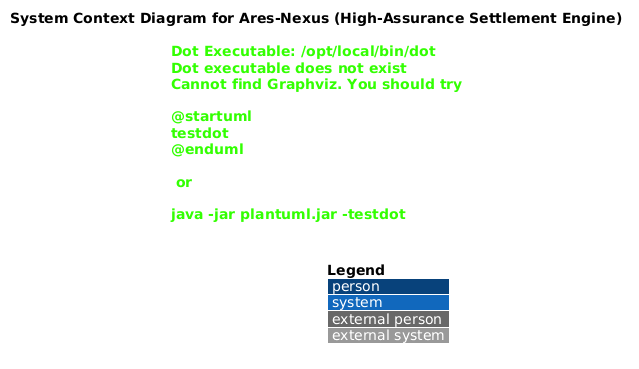

# C4 Model: Ares-Nexus System Architecture

## 1. Level 1: System Context Diagram
**Description:** This diagram defines the scope of Ares-Nexus within the Swiss Financial Ecosystem. It shows how the system interacts with external actors and regulatory bodies.

## 2. Level 2: Container Diagram

## 3. Level 3: Component Diagram

