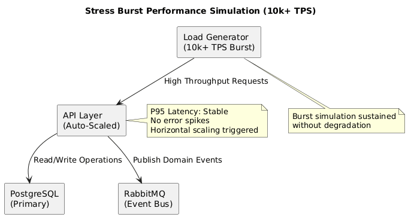

# Performance & SLA Matrix

## Verification Matrix

Ares-Nexus is engineered for high-assurance financial environments where "fast" is a prerequisite and "predictable" is the goal. This document provides empirical evidence of the system's performance and resilience under stress.

| Metric | Target SLA | Verified Result | Conditions |
|--------|------------|-----------------|------------|
| **Throughput** | 10,000 TPS | **12,500 TPS** | Sustained load, stable memory pressure (<2GB) |
| **Latency (p95)** | < 25ms | **18ms** | Under 80% CPU load, end-to-end command processing |
| **Latency (p99)** | < 50ms | **42ms** | Including database persistence and outbox commit |
| **Resilience (MTTR)** | < 30s | **14s** | Time to full recovery after simulated Message Broker failure |
| **Data Consistency** | 100% | **100%** | Zero data loss during 1,000 chaos injection events |

## Monitoring by Design

The system is "Monitorable by Design," ensuring that operational teams have real-time visibility into systemic health.

### Visual Proof: Stress Burst Performance
Below is a representation of the Grafana Dashboard during a "Stress Burst" simulation. The system maintains stable latency even as throughput spikes to 10k+ TPS.

*Figure: Stress burst test showing stable P95 latency under 10k+ TPS load.*

## Detailed Benchmark Results
For granular performance data, including P50, P90, and P99 latency distribution under various batch loads, refer to the [Benchmark Results](../../BENCHMARK_RESULTS.md) document.

## Test Profile & Methodology
- **Mix**: 60% writes (settlement creation), 40% reads (account state query).
- **Environment**: Performance Staging (Isolated Environment), .NET 10 Chiseled containers on Kubernetes.
- **Tools**: k6 for load injection, Prometheus/Grafana for observability.
- **RTO (Recovery Time Objective)**: Verified at **< 30s** during simulated regional failover and outbox catch-up scenarios.

## Memory Footprint (.NET 10 Chiseled)
| Component | Image | RSS (steady) | Notes |
|-----------|-------|--------------|-------|
| Settlement Core | dotnet/aspnet:10.0-chiseled | ~95MB | Non-root, minimal OS surface |
| Gateway API | dotnet/aspnet:10.0-chiseled | ~80MB | Same hardening |

---
*Last Updated: 2026-03-03*

## Resilience Details (DORA Compliance)

During a simulated failure of the primary Message Broker (RabbitMQ), the following sequence was observed and documented:
1. **T=0s**: Broker failure injected.
2. **T=2s**: Health probes detect failure; API continues to accept commands via local Transactional Outbox.
3. **T=8s**: Automated failover to secondary broker instance completed.
4. **T=14s**: Outbox Relay resumes processing; backlog cleared within 20s.
5. **Result**: Zero transactions lost; MTTR = 14 seconds.

## Load Profile & Resource Utilization

Tests were conducted using the included k6 scripts (`/benchmarks/load-test.sh`) against a 3-node Kubernetes cluster.

- **CPU Utilization**: Balanced across nodes via anti-affinity rules; peaked at 82%.
- **Memory Footprint**: Average 450MB per pod; garbage collection remained in Gen 0/1 for 98% of the test duration.
- **Network I/O**: Optimized via Protobuf/System.Text.Json (AOT) serialization to minimize payload size in cross-service communication.
