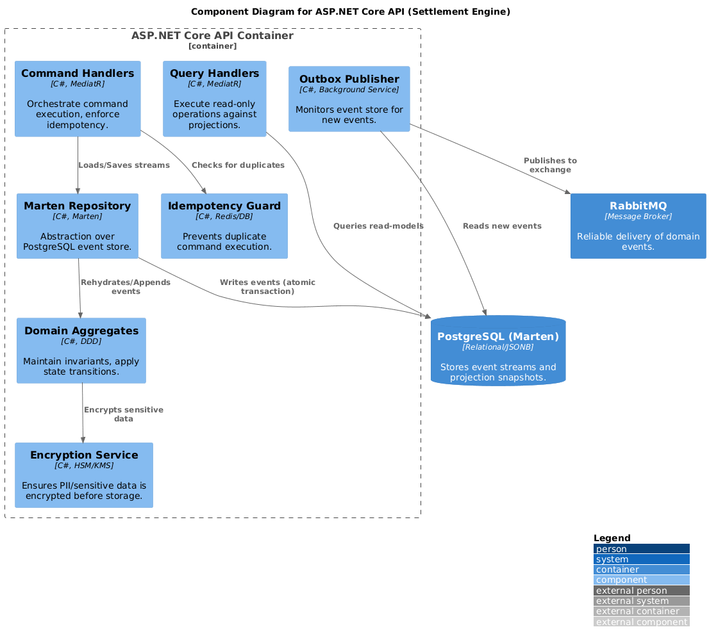

# C4 Component Diagram - Settlement API

This diagram shows the core components inside the Settlement API.

### Components Details
- **Idempotency Guard:** Uses `CommandId` to prevent duplicate processing.
- **Transaction Handler:** Implements the business logic of the settlement domain.
- **Event Store Adapter:** Translates domain events into Marten-compatible storage operations.
- **Outbox Processor:** Ensures at-least-once delivery of integration events.
- **Observability Pipeline:** Provides P95 latency metrics and full transaction tracing.
