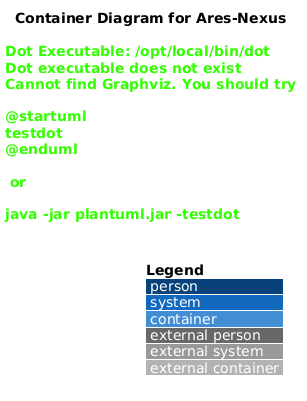

# C4 Container Diagram - AresNexus

This diagram shows the internal containers of the AresNexus system.

### Data Flow
1. **API** receives a request and creates a command.
2. **API** saves the resulting events and an outbox entry to **PostgreSQL** in a single transaction.
3. **Outbox Processor** polls **PostgreSQL** for new outbox entries.
4. **Outbox Processor** publishes the messages to the **Message Broker**.
