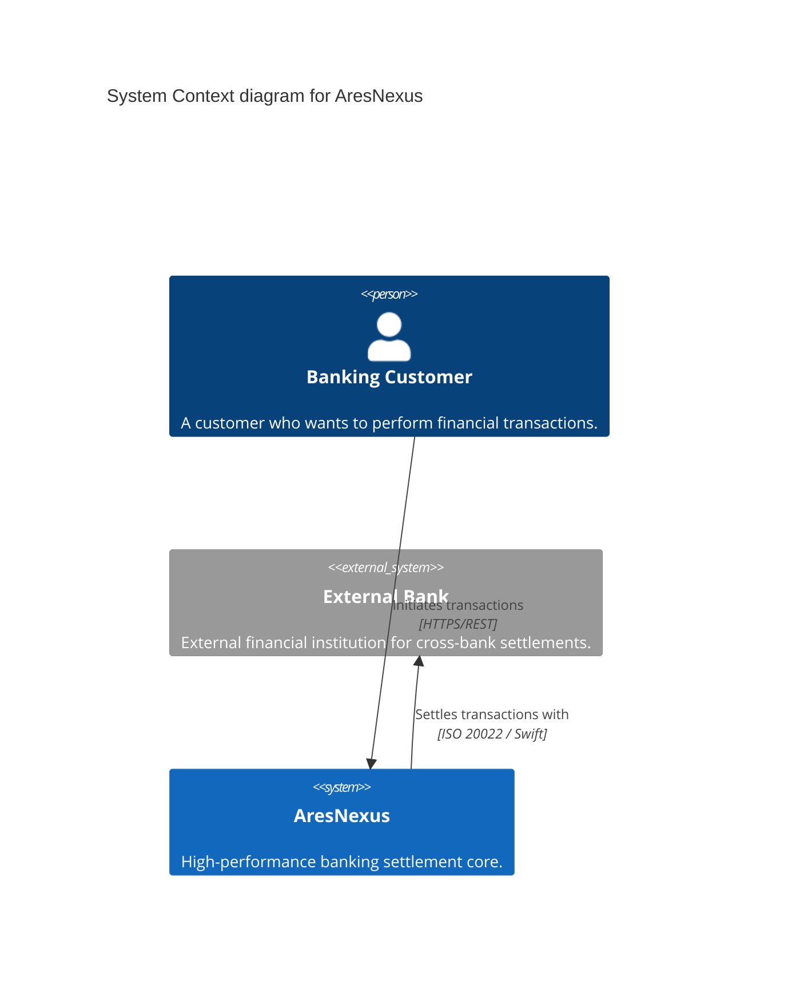

# C4 Context Diagram - AresNexus

This diagram shows the AresNexus system in the context of its external actors and systems.

### Technology Mapping
- **AresNexus API:** ASP.NET Core 10.
- **External Interfaces:** RESTful API for customers, Message-based for banks.
- **Protocol:** TLS 1.3 for all external communication.
