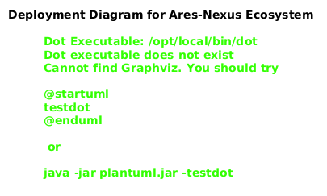

# Deployment Strategy

## Overview
AresNexus utilizes a zero-downtime deployment strategy to ensure continuous availability for settlement operations. We follow the principle of **Immutable Infrastructure** and **Automated Verification**.

## Deployment Models

### 1. Blue/Green Deployment
- **Purpose**: Low-risk production releases.
- **Workflow**: A new "Green" environment is deployed with the latest code version while the "Blue" environment continues to serve production traffic.
- **Switch**: Traffic is redirected at the Load Balancer level once Green passes all health checks and warm-up tests.
- **Rollback**: Immediate switch back to Blue if Green exhibits issues.

### 2. Canary Strategy
- **Purpose**: Safe rollout of experimental features or high-risk architectural changes.
- **Workflow**: Direct 1-5% of traffic to the new version ("Canary").
- **Monitoring**: If error rates or latency spike, the canary is automatically destroyed.
- **Expansion**: Gradually increase traffic (10%, 25%, 50%, 100%) as confidence grows.

## Schema Migration Plan
- **Additive-Only**: Database schema changes (Marten document types or PostgreSQL indices) must be additive and backward compatible.
- **Event Versioning**: As defined in `EventVersioningStrategy.md`, we use upcasting to handle event schema evolution.
- **Two-Phase Deploy**:
    1.  Deploy code that supports both Old and New schema.
    2.  Once all replicas are updated, decommission code that relies on the Old schema.

## Rollback Safety
- **State Preservation**: Rollbacks must not lose transaction data.
- **Forward Compatibility**: The "Old" version must be able to ignore or safely handle data created by the "New" version (using nullable fields and default values).

## Zero-Downtime Constraints
- **Graceful Shutdown**: API replicas must handle SIGTERM by finishing active requests before exiting.
- **Readiness Probes**: Kubernetes will not route traffic to a replica until it is fully initialized (e.g., connected to Marten, warmed up caches).
