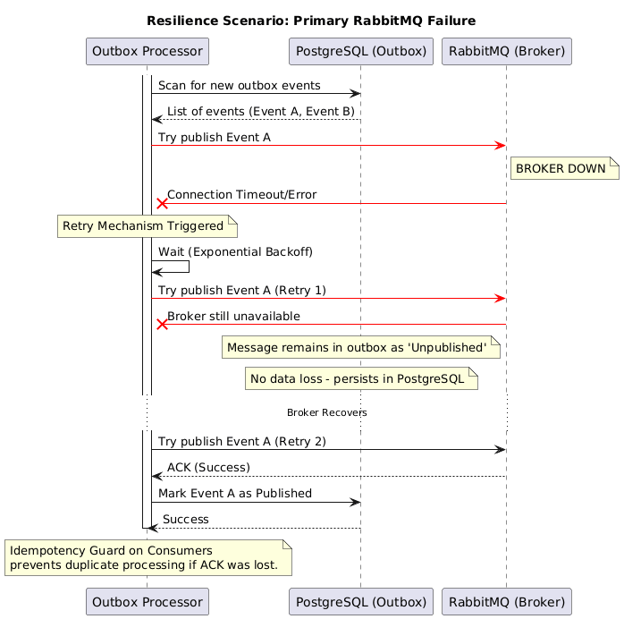

# Resilience Model

## Overview
AresNexus implements a multi-layered resilience model to ensure high availability and data consistency in Tier-1 banking operations. We utilize Polly to handle transient failures and prevent cascading system collapses.

## Resilience in Practice: Handling Failures

## Database Resilience
We use a **Policy Wrap** for all database operations via Marten:
1.  **Retry with Exponential Backoff**: Handles transient network issues or temporary database unavailability.
    - Default: 3 retries.
    - Strategy: $2^n$ seconds delay.
2.  **Circuit Breaker**: Protects the database from being overwhelmed during sustained failure periods.
    - Threshold: 5 consecutive failures.
    - Duration: 30 seconds (configurable).
3.  **Timeout**: Ensures that database operations do not hang indefinitely, freeing up worker threads.
    - Default: 10 seconds.

## Partial Failure Handling
In distributed systems, components can fail partially. 
- **Graceful Degradation**: If the database is under a circuit breaker, the API will return `503 Service Unavailable`, allowing the load balancer to redirect traffic or the client to retry later.
- **Transactional Integrity**: We never sacrifice consistency for availability in the settlement core. If the primary store is unavailable, we do not allow partial writes.

## Why Not Infinite Retry?
Infinite retries can lead to "retry storms," where a recovering system is immediately crushed by a backlog of accumulated requests. Our policy uses bounded retries and circuit breakers to give the system time to recover.
