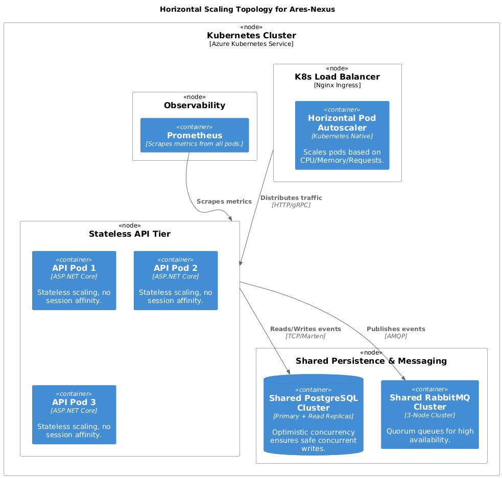

# Scaling Strategy

## Overview
AresNexus is designed to scale horizontally to handle massive settlement volumes. Our architecture relies on stateless application tiers and a highly partitionable persistence layer.

## Horizontal Scaling Strategy

### 1. Stateless API Tier
- **Scaling Unit**: Containerized API replicas (Kubernetes Deployment).
- **Session Management**: No server-side session state. Authentication is JWT-based, and idempotency is handled via a shared Redis cluster.
- **Auto-scaling**: Triggered by CPU usage (>60%) or P95 latency spikes (>25ms).

### 2. Persistence Layer (Marten/PostgreSQL)
- **Primary Scale-Up**: Vertical scaling of the primary PostgreSQL instance to handle higher write throughput.
- **Read Replicas**: Offload balance queries and audit lookups to read-only replicas using asynchronous replication.
- **Partitioning Strategy**: Marten's event store can be partitioned by `stream_id` (AggregateId) to distribute I/O across physical storage volumes.

### 3. Event Store Growth Model
- **Projection**: 1 TB per month (based on 1M transactions per day, including events and outbox messages).
- **Archival Policy**: Move events older than 7 years to cold storage (Azure Blob Storage) to maintain query performance in the active store.

## Backpressure Strategy
To prevent system collapse during unexpected load spikes, we implement an explicit backpressure strategy:

1.  **Queue Length Monitoring**: The Transactional Outbox depth is monitored in real-time.
2.  **Soft Throttling**: When the Outbox depth exceeds 50,000 messages, the Rate Limiter dynamically reduces the `PermitLimit` by 50% for non-critical endpoints.
3.  **Hard Rejection**: If the database connection pool is exhausted or the CPU usage exceeds 90% for a sustained period, the API will return `503 Service Unavailable` with a `Retry-After` header.
4.  **Circuit Breaker Integration**: Our Polly policies automatically open the circuit during database saturation, providing immediate backpressure to upstream callers.

## Sharding Considerations
For ultra-high volumes (beyond a single primary DB capacity), we consider sharding based on **Tenant ID** or **Region ID**. This would require a global routing layer at the API Gateway level to direct requests to the correct regional cluster.
